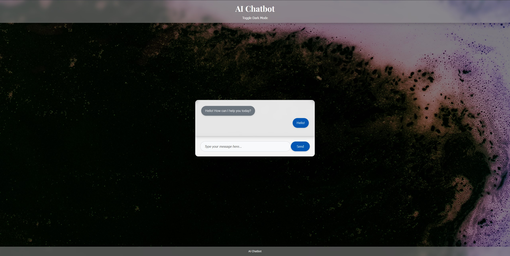

# Simple AI Chatbot



## Overview
AI Chatbot interface web application built using JavaScript, Node.js, Express, and the OpenAI API (gpt-3.5-turbo model). 

## Features
-   Simple and clean user interface for chatting.
-   Powered by OpenAI's gpt-3.5-turbo model.
-   Utilizes Node.js and Express for the backend server.
-   Frontend built with vanilla JavaScript, HTML, and CSS.
-   Easy to set up and run locally.

## Technologies Used
-   **Frontend:** HTML, CSS, JavaScript
-   **Backend:** Node.js, Express
-   **AI API:** OpenAI API (`gpt-3.5-turbo` model)
-   **Environment Management:** `dotenv`

## Setup Instructions
1. **Clone the Repository:**
   ```bash
   git clone https://github.com/Saed-K/simple-ai-chatbot.git 

2. **Navigate to the Project Directory:**
   ```bash
   cd simple-ai-chatbot

3. **Install Node.js dependencies:** 
    Make sure you have Node.js and npm installed. Navigate to the project directory in your terminal and run:
    ```bash
    npm install
    ```
    This will install `express`, `dotenv`, and `openai`.

3.  **Set up your OpenAI API Key:**
    -   Create a `.env` file in the root directory of the project.
    -   Obtain an API key from the OpenAI platform ([https://platform.openai.com/](https://platform.openai.com/)).
    -   Add the following line to your `.env` file, replacing `YOUR_API_KEY` with your actual API key:
        ```
        OPENAI_API_KEY=YOUR_API_KEY
        ```


4.  **Run the server:**
    ```bash
    npm start
    ```
    This command starts the Node.js server. You should see a message in your console indicating that the server is running (e.g., "Server is running on port 3000").

5.  **Open the Chatbot in your browser:**
    Go to `http://localhost:3000` in your web browser to access the chatbot interface.
